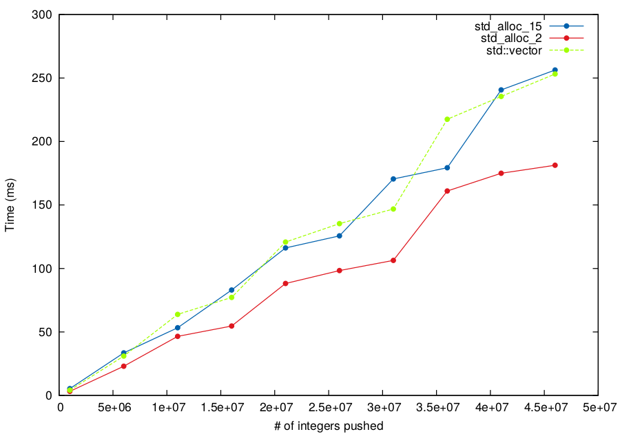
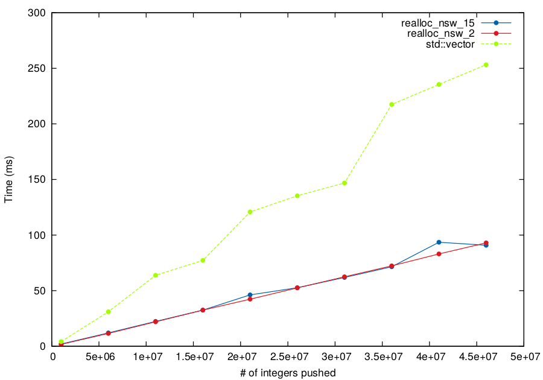
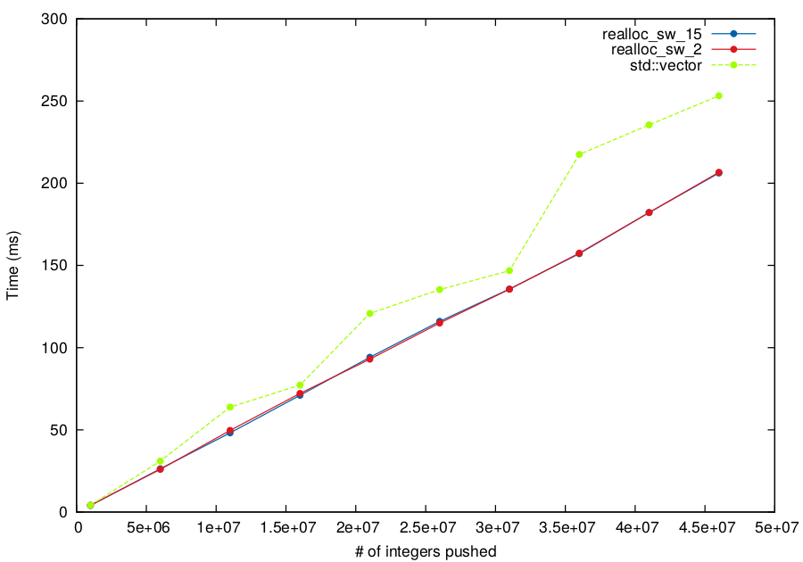

pector: a C++11 std::vector-compliant implementation with a customizable size type and growing algorithm
========================================================================================================

``pector`` is a portable C++11 implementation of std::vector with a compatible
interface. It aims at fixing issues that can be encountered with the well-known
implementations of std::vector (like GNU's and LLVM's) in some corner cases.

For now, it is known to be compatible with these compilers:

* GCC 4.8.x and 4.9.x (in C++11 mode)
* Clang 3.4, 3.5, 3.6 (in C++11 mode)
* Clang under OSX (in C++11 mode)
* Microsoft Visual Studio 2015

No C++98-only compiler is supported at this moment. This will be planned for
future releases.

.. contents::

Installation instructions
-------------------------

This is a header only library. There are two ways to install it: by using CMake
or manual copy.

Installation with CMake
~~~~~~~~~~~~~~~~~~~~~~~

CMake will allow two things: installing the ``pector`` headers at the right place
in your system and build the tests suite.

Here are the steps:

.. code:: bash
  
  $ git clone https://github.com/aguinet/pector
  $ cd pector
  $ mkdir build
  $ cmake -DCMAKE_BUILD_TYPE=relwithdebinfo ..
  $ make
  $ make test
  $ sudo make install

It is generally a good idea to run the tests suite to ensure there is no issue
with your particular system (especially compiler). 

Installation by manual copy
~~~~~~~~~~~~~~~~~~~~~~~~~~~

You can manually copy the ``include/pector`` directory in your project. You need
to set an include path so that

.. code:: cpp
  
  #include <pector/pector.h>

will be valid.

Quick usage
-----------

After installation, you just need to include one header file in your project:

.. code:: cpp
  
  #include <pector/pector.h>

Then, you can simply replace ``std::vector`` by ``pt::pector`` in your code. By
default, the same choices as the one done in standard implementations are done,
apart from the growing strategy that multiply the size of the vector by 3/2
(instead of 2).
With this configuration, you shouldn't see any performance degradations and
even some improvements in some cases (see section `Advanced usages`_).

See the `Advanced usages`_ section for possible optimisations and improvements for your cases!

Why another vector implementation ?
-----------------------------------

``std::vector`` does a great job for most use cases, but there are some
limitations, due to implementation choices or what the standard actually
allows.

Growing strategy
~~~~~~~~~~~~~~~~

The first limitation is the growth strategy chosen by the implementation. Many
of them made one choice that can't be changed by the user. For instance, LLVM's
``std::vector`` implementation (as of January 2015) will multiply by 2 the
vector capacity if room is needed. You might want to choose a smaller factor, or
simply not to do this if for instance your vector already takes 2GB of memory. 

sizeof(std::vector)
~~~~~~~~~~~~~~~~~~~

The second one is the size of an ``std::vector`` object. Most implementations uses
three pointers to store the beginning, the end (of objects) and the end of
storage of the container. This leads to a 24 bytes object on 64-bit systems. If
your container as less than ~2**32 objects (which might be often the case ;)),
it can be interesting to use two 32-bits unsigned integers to store the number
of objects and the capacity of the container.

realloc support
~~~~~~~~~~~~~~~

The third one is the lack of support for ``realloc``. The ``realloc`` might
allow "in-place" reallocation as there are already room available at the end of
the actual buffer, thus removing the need for a copy of the previous buffer
into the new allocated one. Note that this can only be used for POD objects as
this copy is implicitly done by ``realloc`` if needed. POD type would need a
kind of ``realloc_no_copy`` interface to be efficient (a proposal was done for
this (http://www.open-std.org/jtc1/sc22/wg21/docs/papers/2013/n3495.txt), but
never accepted :/)

We might consider using it for non-POD types, but benchmarking must be done to
see if this useless copy is generally negligible versus the potential "in-place
reallocation" gain.

"resize but do not construct"
~~~~~~~~~~~~~~~~~~~~~~~~~~~~~

The fourth one is the lack of a "resize but do not construct" operation. This
can lead to performance gain in loops like this one:

.. code:: cpp

  std::vector<float> f(const size_t n, float const* a, float const* b)
  {
      std::pector<float> ret;
      ret.resize(n);
      for (size_t i = 0; i < n; i++) {
        ret[i] = a[i] + b[i];
      }
      return ret;
  }

Indeed, in this scenario, the ``resize`` method will call the constructor of the
"int" object, which will basically set the whole container to 0. This operation
is useless as we set the whole container to other values beyond. We could use
``reserve`` to avoid this, but we would end up with a code that has to use
``emplace_back`` (because with ``reserve``, the size of the container would remain
to zero), giving this:

.. code:: cpp

  std::vector<float> f(const size_t n, float const* a, float const* b)
  {
      std::pector<float> ret;
      ret.reserve(n);
      for (size_t i = 0; i < n; i++) {
        ret.emplace_back(a[i] + b[i]);
      }
      return ret;
  }

The issue here is that we have just lost the vectorization that the compiler
was able to do (with modern CPUs) with the original code (and some other
various optimisations, like the ability to use OpenMP on this loop). So, to
have both word, we provide a ``resize_no_construct`` API that will actually
resize the container without creating the underlying objects. **It is the
responsability of the caller to do such a thing**. The code ends up like this:

.. code:: cpp

  std::vector<float> f(const size_t n, float const* a, float const* b)
  {
      std::pector<float> ret;
      ret.resize_no_construct(n);
      for (size_t i = 0; i < n; i++) {
        ret[i] = a[i] + b[i];
      }
      return ret;
  }

Here, we end-up with a container with the good size, without a useless write of
zeros and with a potentially vectorized and/or OpenMP code! This API can be
dangerous with non-POD types, see the `Advanced usages`_ section for more
informations.

Size-aware allocator
~~~~~~~~~~~~~~~~~~~~

Last but not least, ``std::vector`` does not leverage the possibility that
an allocator might be able to know the amount of allocated memory of a given
pointer. This allows two optimisations: being able not to store the capacity of
the vector (thus gaining memory) and a better memory usage.

Not reinventing the wheel
~~~~~~~~~~~~~~~~~~~~~~~~~

Other implementations of std::vector exists (like
https://github.com/facebook/folly/blob/master/folly/docs/FBVector.md), but none
of them fixed all of these issues. So that's what we tried to achieve here.

We are now describing the various features of ``pector``.

Features
--------

The main features of ``pector`` are the following:

* stores a pointer and two unsigned integers (for the size and the capacity),
  instead of three pointers as commonly done. The key feature is the ability to
  specify the size type:

.. code:: cpp

  pt::pector<int, std::allocator<int>> v;
  // sizeof(v) == sizeof(int*) + 2*sizeof(size_t)
  
  pt::pector<int, std::allocator<int>, uint32_t> v;
  // sizeof(v) == sizeof(int*) + 2*sizeof(uint32_t)

This can save lots of memory in cases where you have a lot of relatively "small" vector objects in your software (especially in 64-bits).

* POD-types optimisation: uses ``memcpy``, ``memmove``, ``memcmp`` and alike
  functions when possible with POD types

* realloc-aware allocator: for instance, ``realloc`` can be used for POD types

* size-aware allocator: do not store the capacity of the container if the
  allocator is capable of giving the allocated size associated with a pointer.
  For instance, ``malloc_usable_size`` can be used on GNU systems.

.. code:: cpp

  pt::pector<int, pt::malloc_allocator<int>> v;
  // sizeof(v) == sizeof(int*) + sizeof(size_t)

This makes the object 16 bytes wide on 64-bit systems (where std::vector is generally 24 bytes).

* configurable growing strategy:

  The growing strategy is used when the vector needs to grow (when using
  ``emplace``, ``emplace_back``, ``push_back`` or ``insert``). Most vector
  implementations do not allow the user to choose how to grow the vector
  capacity (linearly, exponentially, etc...). By default, ``pector`` multiply
  the capacity by 3/2, but you can implement you own strategy. See
  ``pector/recommended_size.h`` for examples.

* ``resize_no_construct`` API: this gives the ability to resize a container
  without calling the default constructor of the underlying objects. For
  instance, for a vector of integers, this remove the first initialisation at
  zero, which can be costly in some situations.

* if you know what you are doing, integer overflow checks can be disabled for
  performance reasons.

Advanced usages
---------------

Advanced usage are mainly done thanks to the template parameters provided by ``pector``.
The API then is the same than ``std::vector``. We describe here how to use them
with some examples.

The signature of the ``pector`` class is the following:

.. code:: cpp

  template <class T, class Alloc = std::allocator<T>, class SizeType = size_t, class RecommendedSize = default_recommended_size, bool check_size_overflow = true>
  class pector;

We will explain each parameter and their interest.

Object size optimisation
~~~~~~~~~~~~~~~~~~~~~~~~

As said previously, the size of an std::vector object is generally the size of
3 pointers. That is, on 64-bit systems, 24 bytes. As you may not have 2**64
objects in your container, you may want to use 32-bit (or even smaller)
unsigned integers to store the size of the container, and thus gain memory.

``pector`` allows this by storing a pointer and two integers whose type is user controllable:

.. code:: cpp

  // using uint32_t as size type
  pt::pector<int, std::allocator<int>, uint32_t> v1;
  std::cout << sizeof(v1) << std::endl;

With default packing, this code will output:

.. code::
  
  16

By default, integer overflow checks are performed when the size of the
container grows. This can be disabled (see `Disabling integer overflow checks`_).

.. _disabled: disable-overflow-checks

POD-type detection and perfect forwarding
~~~~~~~~~~~~~~~~~~~~~~~~~~~~~~~~~~~~~~~~~

``pector`` uses optimized functions of the C standard library for memory
copying when using POD types.

This adds however an issue for perfect forwarded types. Indeed, it is possible
to create an ``std::vector`` object for types that are perfectly forwarded (as
you only need to store pointers to this type).

For ``pector`` to work with perfect forwarded types, you need to specialized
``std::is_pod`` for these given types. Here is an example (extracted from
``tests/forward_decl.cpp``) that declares B has a **non-POD** type:

.. code:: cpp
  
  struct B;

  namespace std {
  template <>
  struct is_pod<B>: public std::false_type { };
  } // std
  
  typedef pector<B> pector_b;

.. warning:: if you declare a non-POD type as a POD one, you will encounter all kinds of memory errors, as objects will never be constructed!

Enhanced malloc-based allocator
~~~~~~~~~~~~~~~~~~~~~~~~~~~~~~~

``pector`` can use an enhanced interface based on std::allocator to provides more features. The two concepts introduced are:

* size-aware allocator: given a pointer allocated by them, these allocators are
  able to give the real amount of memory reserved (one example is
  ``malloc_usable_size``). The interface to implement is:

.. code:: cpp

	size_type usable_size(const_pointer p) const

* reallocable allocator: support for a reallocate(pointer, size_type) function
  that can potentially reallocate "in place" a given buffer. The interface to implement is:

.. code:: cpp

	pointer realloc(pointer p, size_type const n)

In order to have ``pector`` still compatible with standard allocator, an
"enhanced" allocator has to derive from empty structures in order to "announce"
if it supports one of these interfaces. These structures are declared in
``pector/enhanced_allocators.h`` and simply are:

.. code:: cpp

  struct size_aware_allocator { };
  struct reallocable_allocator { };

with the associated "traits":

.. code:: cpp

  template <class Alloc>
  struct is_size_aware_allocator: public std::is_base_of<size_aware_allocator, Alloc>
  { };
  
  template <class Alloc>
  struct is_reallocable_allocator: public std::is_base_of<reallocable_allocator, Alloc>
  { };

One example of such allocator is the ``malloc_allocator`` defined in ``pector/malloc_allocator.h``.
It uses the C standard malloc,free,realloc to provide the "reallocable" idiom.
If GNU extensions are available, it uses the ``malloc_usable_size`` function to
provide the "size-aware" idiom.

Moreover, the user can choose which idiom to "enable", using two boolean template parameters:

.. code:: cpp

  template <class T, bool make_reallocable = true, bool make_size_aware = false>
  class malloc_allocator;

For instance, this ``pector`` object:

.. code:: cpp

  pt::pector<int, pt::malloc_allocator<int, true, false>> v;

will uses ``realloc`` for reallocations but won't do any size optimisation of
the vector object (as described in ``Object size optimisation``).

The growing strategy
~~~~~~~~~~~~~~~~~~~~

When a pector object needs to grow (using ``emplace_back`` for instance), it
has to decide about its new capacity size. The first solution would just be to
add the necessary space, but this can lead to quadratic growth performance (see
http://www.drdobbs.com/c-made-easier-how-vectors-grow/184401375 for a nice
explanation of this phenomena).

What could be interesting though is to control the

The existing strategies are the following:

* dummy (class ``recommended_size_dummy``): just return the wanted capacity ;
* multiply (class ``recommended_size_multiply_by``): multiply the old capacity by a rational fraction. This is the one used by default with 3/2 ;
* add (class ``recommended_size_add_by``): just add a constant the old capacity.

To use a particular strategy, just specific it when instantiating the ``pector`` object:

.. code:: cpp

  // This will create a pector object with a growing strategy of multiplying the old capacity by 2
  pt::pector<int, std::allocator<int>, size_t, pt::recommended_size_multiply_by<2,1>> v;

The default one is used with a factor of 1.5, which allows for a better memory
usage with common allocators (see
https://github.com/facebook/folly/blob/master/folly/docs/FBVector.md for an
explanation).

To implement a new growing strategy (which might better fit a specific allocator, like what have been done with FBVector in the link above), just declare a structure with one interface:

.. code:: cpp

  struct my_recommended_size
  {
  	template <class SizeType>
  	static inline SizeType recommended(SizeType const max_size, SizeType const old_cap, SizeType const new_cap);
  };

The role of the ``recommended`` function is to return the new capacity of the
vector given the old one, the new wanted one and the maximum number of objects
that the container can hold.

"Resize but do not construct" idiom
~~~~~~~~~~~~~~~~~~~~~~~~~~~~~~~~~~~

See above for the explanation about the necessity of such idiom. The
``resize_no_construct`` function will change the actual size of the container
to the user-supplied one without creating underlying objects.

.. warning:: when using this API with non-POD types, the user is responsible for the creation of the new objects! Maybe this feature will be only available for POD-types in the future.

Disabling integer overflow checks
~~~~~~~~~~~~~~~~~~~~~~~~~~~~~~~~~

Integer overflow checks are done in the function that needs to enlarge the size
of the container (like ``emplace_back``). If such overflow occurs, an
``std::length_error`` exception is thrown.

**If you known what you are doing**, and, for performance reasons, you want to
disable this check, you can do so by using the last template parameter of a
``pector`` object. For instance:

.. code:: cpp

  pector<int, std::allocator<int>, size_t, pt::default_recommended_size, false> v;

will create an object that will not perform these checks.

Please note that they only occur at the level of the number of objects inside
the container, not its capacity. This issue at the "capacity level" is handled
by the growing strategy (see `The growing strategy`_).

Performance of pushing values
-----------------------------

Below is a graph of the performances of adding a given number of consecutive
signed 32-bit integers, using different configurations. The code use is in the
``grow_perfs`` test case. This is a compared against GCC's libstdc++
``std::vector`` implementation.  These tests have been run on a Core i7
i7-3520M.

The first configuration is using ``pector`` with the standard allocator, and
two growing strategies : one that multiples the allocated size by 1.5, and the
other by 2. The results are show below:

Then, ``pector`` is used with the special ``malloc_allocator`` in reallocable
mode (without the "size-aware" mode), still using the same two growing
strategies. The results are shown below:

Finally, ``pector`` is used with the special ``malloc_allocator`` in
reallocable and "size-aware" mode, using the same two growing strategies. The
results are shown below:

What we can see is that using ``realloc`` implies a nice performance gain (~x3
against the standard ``std::vector`` class). We can also notice that pector is
equivalent or better than the standard implementation in every case but when
the allocator is "size-aware". This is due to the cost of the calls to
``malloc_usable_size`` (see `TODO`_ below).

Note also that the internal state of the standard allocator might influence
the performances of such workloads, thus benchmarking your own code in
"real-life situation" is still necessary to see the real benefits of ``pector``.

TODO
----

TODO list:

* use ``malloc_usable_size`` the get the real vector capacity when possible
  (and still store the allocation size for performance reasons, see `Performance
  of pushing values`_).
* be less strict between the types of the pector objects that can be swapped
* C++98 only compiler support

Contribute!
-----------

Feel free to fork this project on GitHub and propose fixes/features!

Acknoweldgments
---------------

Thanks to Serge "serge-sans-paille" Guelton
(https://github.com/serge-sans-paille) and Joel Falcou for their initial
remarks, advices and/or fixes!

See CONTRIBUTORS for the list of contributors.

Contacts
--------

You can drop an email at adrien@guinet.me for any questions/remarks/suggestions!
